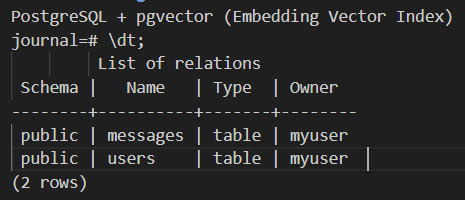
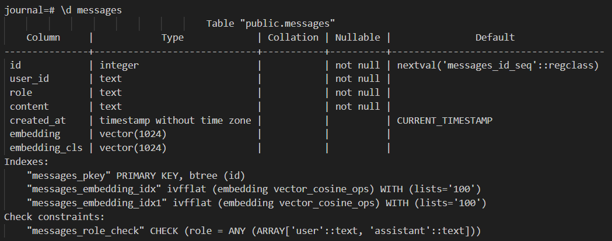

# lua-monologue (개인 일기 작성/검색 & AI 답변)

## 프로젝트 개요
나만의 일기를 DB에 저장하고,
문장 임베딩(Vector)를 이용해 **비슷한 과거 기록을 검색**한 뒤,
LLM이 참고해서 더 맥락 있는 답변을 생성해주는 프로젝트입니다.

- **목표**: 개인화된 AI 비서
- **주요 사용 기술**: Vue JS + Golang + Rust + PostgreSQL + pgvector + Python + LLM (ollama)

기본적으로 사용자의 일기(메시지)에 LLM을 활용하여 응답해주는 AI와의 대화 서비스
사용자의 메시지를 Embedding하여 DB에 저장해서 추후 사용자 메시지를 응답할 때 저장된 사용자 정보를 사용한다.
예시) 개발 당시 빠다코코넛 과자를 먹고 있어서 내가 좋아하는 과자를 빠다코코넛으로 인식한 것을 확인 가능

## 주요 기능
- **일기 작성**: 일기를 DB에 저장하면서 embedding vector 생성
- **유사 내용 검색**: 사용자의 새 질문과 가장 유사한 과거 기록 검색
- **LLM 답변 생성**: 검색된 내용을 context로 LLM에 전달, 답변 생성
- **RAG 파이프라인**: 검색 → 재정렬 → Prompt → Output

## 기술적 특징
- **RAG 파이프라인 설계**
  - DB에 원문 + Embedding Vector 함께 저장
  - 새 질문은 Sentence Embedding → Vector Similarity Search → LLM Prompt로 전달
- **pgvector 활용**
  - Postgres 내부에서 벡터 연산 지원
  - Index로 빠른 유사도 검색
- **CLS Token / Mean Pooling 병행**
  - 문장 기반/단어 기반 Embedding 비교 실험
- **Rerank**
  - Top-N 검색 결과를 LLM으로 다시 스코어링하여 답변 품질 향상

## 시스템 아키텍처
### 시나리오 기반
```mermaid
graph LR
A[User Input] --> B[Sentence Embedding]
B --> C[pgvector Similarity Search]
C --> D[Relevant Diary Entries]
D --> E[LLM Prompt]
E --> F[AI Response]
```

### Module 기반
```mermaid
graph LR
Frontend[User Diary / Messages] --> Middleend

Middleend --> Backend
Middleend --> LLMServer

Backend --> DBServer

LLMServer -->|Embedding| DBServer
LLMServer -->|Search relevant info & LLM Prompt| Ollama
Ollama --> LLMServer

LLMServer -->|LLM Response| Middleend

Middleend -->|Final Response| Frontend
```

## lua-monologue-frontend
vue js 사용
npm install axios

### tailwindcss 설치
npm install -D tailwindcss@3.3.5
npx tailwindcss init -p

tailwind.config.js

    export default {
    content: [
        "./index.html",
        "./src/**/*.{vue,js,ts,jsx,tsx}"
    ],
    theme: {
        extend: {},
    },
    plugins: [],
    }

src/assets/index.css
    @tailwind base;
    @tailwind components;
    @tailwind utilities;

main.ts
    import './assets/index.css'

## lua-monologue-middleend
### golang
  
    go mod init middleend
    go mod tidy

### grpc
    go install google.golang.org/protobuf/cmd/protoc-gen-go@latest
    go install google.golang.org/grpc/cmd/protoc-gen-go-grpc@latest

    protoc --plugin=protoc-gen-go-grpc=$HOME/go/bin/protoc-gen-go-grpc --go-grpc_out=. --go_out=. proto/chat.proto

## lua-monologue-backend
### Rust
### grpc

build.rs

    fn main() {
        tonic_build::configure()
            .build_server(true)
            .out_dir(std::env::var("OUT_DIR").unwrap())  // 기본적으로 OUT_DIR에 생성
            .compile(&["proto/chat.proto"], &["proto"])
            .expect("Failed to compile proto files");
    }

### DB 통신

## lua-monologue-llm-server
### python
### Fast API
### ollama API
### DB 통신
### Mean Polling + CLS Token 기반 Embedding
    model = SentenceTransformer("hkunlp/instructor-xl")
    
    # ...
    
    input_text = ["Represent the semantic meaning of the sentence", content]

    token_embeddings = model.encode([input_text], output_value='token_embeddings')
    token_embeddings = token_embeddings[0]

    cls_embedding = token_embeddings[0].cpu().numpy()
    cls_str = f"[{','.join(map(str, cls_embedding))}]"

    mean_embedding = np.mean(token_embeddings.cpu().numpy(), axis=0)
    mean_str = f"[{','.join(map(str, mean_embedding))}]"

    cur.execute("""
        UPDATE messages
        SET embedding = %s,
            embedding_cls = %s
        WHERE id = %s         
    """, (mean_str, cls_str, msg_id))
### RAG Rerank

    candidates = []

    for id, content, emb_vector, created_at, source in mean_results + cls_results:
        candidates.append((id, content, emb_vector, created_at, source))

    rerank_scores = []

    for id, content, emb_vector, created_at, source in candidates:
        if emb_vector is None:
            print("emb_vector is not yet completed")
            continue
        
        emb_np = np.array(eval(emb_vector))

        if source == 'mean':
            score = cosine_similarity([query_mean_embedding], [emb_np])[0][0]
        if source == 'cls':
            score = cosine_similarity([query_cls_embedding], [emb_np])[0][0]
        
        rerank_scores.append((id, content, score, created_at, source))

    rerank_scores.sort(key=lambda x: x[2], reverse=True)
    top_contexts = [(content, created_at) for _, content, _, created_at, _ in rerank_scores[:3]]
    print(rerank_scores)
    print(top_contexts)

    context_block = "\n\n".join(f"Context {i+1} ({d.strftime('%Y-%m-%d')}): {c}" for i, (c, d) in enumerate(top_contexts))

    final_prompt = f"""
    YOU are a helpful AI assistant.
    Based on the following past diary entries, answer the user's question.

    {context_block}

    User's Question:
    {req_prompt}
    
    Your Answer:
    """

## lua-monologue-db
  
  
  
  
