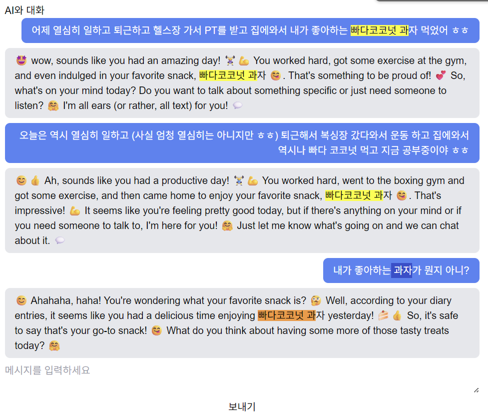

# lua-monologue (개인 일기 작성/검색 & AI 답변)

## 프로젝트 개요
나만의 일기를 DB에 저장하고,
문장 임베딩(Vector)를 이용해 **비슷한 과거 기록을 검색**한 뒤,
LLM이 참고해서 더 맥락 있는 답변을 생성해주는 프로젝트입니다.

- **목표**: 개인화된 AI 비서
- **주요 사용 기술**: Vue JS + Golang + Rust + PostgreSQL + pgvector + Python + LLM (ollama)

기본적으로 사용자의 일기(메시지)에 LLM을 활용하여 응답해주는 AI와의 대화 서비스
사용자의 메시지를 Embedding하여 DB에 저장해서 추후 사용자 메시지를 응답할 때 저장된 사용자 정보를 사용한다.
예시) 개발 당시 빠다코코넛 과자를 먹고 있어서 내가 좋아하는 과자를 빠다코코넛으로 인식한 것을 확인 가능

## 주요 기능
- **일기 작성**: 일기를 DB에 저장하면서 embedding vector 생성
- **유사 내용 검색**: 사용자의 새 질문과 가장 유사한 과거 기록 검색
- **LLM 답변 생성**: 검색된 내용을 context로 LLM에 전달, 답변 생성
- **RAG 파이프라인**: 검색 → 재정렬 → Prompt → Output

## 기술적 특징
- **RAG 파이프라인 설계**
  - DB에 원문 + Embedding Vector 함께 저장
  - 새 질문은 Sentence Embedding → Vector Similarity Search → LLM Prompt로 전달
- **pgvector 활용**
  - Postgres 내부에서 벡터 연산 지원
  - Index로 빠른 유사도 검색
- **CLS Token / Mean Pooling 병행**
  - 문장 기반/단어 기반 Embedding 비교 실험
- **LLM 재랭킹 (optional)**
  - Top-N 검색 결과를 LLM으로 다시 스코어링하여 답변 품질 향상

## 시스템 아키텍처
### 시나리오 기반
A[User Input] --> B[Sentence Embedding]
B --> C[pgvector Similarity Search]
C --> D[Relevant Diary Entries]
D --> E[LLM Prompt]
E --> F[AI Response]

### Module 기반
Frontend[User Diary/Messages] --> Middleend
Middleend[User info, messages] --> Backend --> DB Server
                               --> LLM Server[Embedding] --> DB Server
LLM Server[Search relevant info & LLM Prompt] <--> Ollama
LLM Server[LLM Response] --> Middleend
Middleend[Final Response] --> Frontend

## 기술 스택
### lua-monologue-frontend
vue js 사용
npm install axios

#### tailwindcss 설치
npm install -D tailwindcss@3.3.5
npx tailwindcss init -p

tailwind.config.js

    export default {
    content: [
        "./index.html",
        "./src/**/*.{vue,js,ts,jsx,tsx}"
    ],
    theme: {
        extend: {},
    },
    plugins: [],
    }

src/assets/index.css
    @tailwind base;
    @tailwind components;
    @tailwind utilities;

main.ts
    import './assets/index.css'

### lua-monologue-middleend
golang 기반

go mod init middleend
go mod tidy

#### grpc
go install google.golang.org/protobuf/cmd/protoc-gen-go@latest
go install google.golang.org/grpc/cmd/protoc-gen-go-grpc@latest

protoc --plugin=protoc-gen-go-grpc=$HOME/go/bin/protoc-gen-go-grpc --go-grpc_out=. --go_out=. proto/quiz.proto

### lua-monologue-backend
Rust 기반

### lua-monologue-llm-server
python 기반

### lua-monologue-db
PostgreSQL + pgvector (Embedding Vector Index)
journal=# \dt;
         List of relations
 Schema |   Name   | Type  | Owner
--------+----------+-------+--------
 public | messages | table | myuser
 public | users    | table | myuser
(2 rows)

journal=# \d messages
                                          Table "public.messages"
    Column     |            Type             | Collation | Nullable |               Default
---------------+-----------------------------+-----------+----------+--------------------------------------
 id            | integer                     |           | not null | nextval('messages_id_seq'::regclass)
 user_id       | text                        |           | not null |
 role          | text                        |           | not null |
 content       | text                        |           | not null |
 created_at    | timestamp without time zone |           |          | CURRENT_TIMESTAMP
 embedding     | vector(1024)                |           |          |
 embedding_cls | vector(1024)                |           |          |
Indexes:
    "messages_pkey" PRIMARY KEY, btree (id)
    "messages_embedding_idx" ivfflat (embedding vector_cosine_ops) WITH (lists='100')
    "messages_embedding_idx1" ivfflat (embedding vector_cosine_ops) WITH (lists='100')
Check constraints:
    "messages_role_check" CHECK (role = ANY (ARRAY['user'::text, 'assistant'::text]))

journal=# \d users
                                          Table "public.users"
    Column     |            Type             | Collation | Nullable |              Default
---------------+-----------------------------+-----------+----------+-----------------------------------
 id            | integer                     |           | not null | nextval('users_id_seq'::regclass)
 username      | text                        |           | not null |
 password_hash | text                        |           | not null |
 created_at    | timestamp without time zone |           |          | CURRENT_TIMESTAMP
 last_login    | timestamp without time zone |           |          |
Indexes:
    "users_pkey" PRIMARY KEY, btree (id)
    "users_username_key" UNIQUE CONSTRAINT, btree (username)